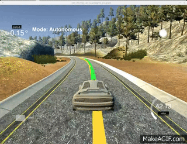

# Model Predective Control

Model Predective Control (MPC) is implemented to drive the car autonmously on the track, which is done as part of udacity self driving car engineer nano degree(https://www.udacity.com/drive).

