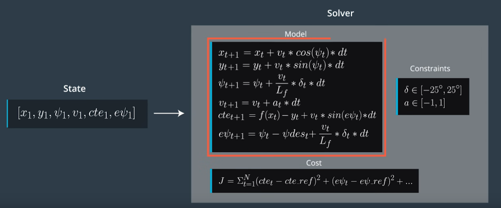

# Model Predective Control

Model Predective Control (MPC) is implemented to drive the car autonmously on the track, which is done as part of udacity self driving car engineer nano degree(https://www.udacity.com/drive).

for Result [check](https://www.youtube.com/watch?v=TeZY0GmgeAM&feature=youtu.be)

### Approach
For model predicitve model control, I used the simple kinematic model with the model state consiting of following parameters

* x position
* y position
* velocity
* orientation
* cross track error
* orientation error

The control action is on 2 actuators
* steering angle
* acceleration 

The following image shows the state, model update equations, constraints and the cost:

The values N (timestep length) and dt (elapsed duration between timesteps) are crucial for working of MPC, I have used N=15 and dt=0.1 after trying with different values. The smaller the dt is the finer the control will be and the larger the N is the large we approximate over that duration. Making N larger is not a good idea as it takes large computation time because increasing the N makes the solver optimize the solution those many times.

The MPC computes the cross track error (cte) and orientation error based on the state, then minimizes the cost function based on the constraints and the controller computes the optimal desired steering angle and throttle which makes the car to drive on the road keeping the car to center of the road.

